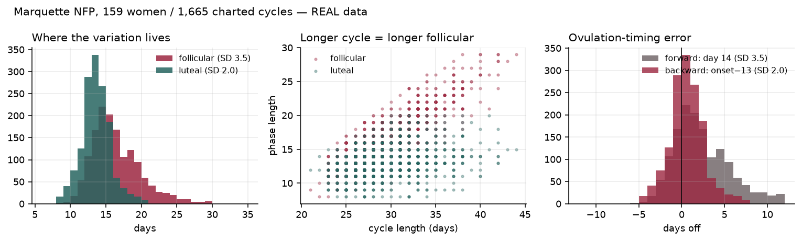

# cycle-analysis

A personal research project on how the menstrual cycle affects day-to-day energy, focus, mood and effort, and whether a woman's own data can tell her when to push and when to protect her time.

The approach follows what the evidence supports: physiology and symptom burden change measurably across the cycle, while objective cognitive performance does not. So the goal is not universal "phase advice" but a **personal model** that learns each person's own pattern, and says so honestly when her cycle isn't what drives her energy.

## What's in here

| Path | What it is |
|---|---|
| `app/checkin.html` | The evening check-in page (a claude.ai Artifact). Phone-first, one private log per person. |
| `notebooks/01_arslan.py` | Analysis of the Arslan et al. diary data (synthetic release): phase-counting coverage, desire curves, fertile-window contrast vs. hormonal-contraception controls, mixed model. |
| `notebooks/02_marquette.py` | Analysis of real charted cycles (Marquette NFP): where cycle-length variance lives and what "day 14 = ovulation" costs. |
| `notebooks/03_apple_health.py` | Turns an Apple Health `export.zip` into one row per day. |
| `docs/cycle-evidence-dossier.html` | Literature review: what's supported, what isn't, which datasets exist. |
| `out/` | Charts produced by the notebooks. |

## Findings so far

**Phase counting (Marquette NFP, 1,478 charted cycles, 156 women)**
- 74.4% of cycle-length variance is in the follicular phase; r(cycle, follicular) = +0.83 vs r(cycle, luteal) = +0.30.
- "Day 14 = ovulation" is off by more than 3 days in **30.5%** of cycles.
- Counting back from the next period is off by more than 3 days in **9.4%** of cycles (using onset − 13, which removes the bias of onset − 14). The error SD drops by 41%.
- The luteal phase is steadier but not fixed: mean 13.1 days, SD 2.0.



**The Arslan OSF download is synthetic.** It preserves marginal and bivariate structure but not within-person longitudinal structure (within-person r(day, days-until-onset) = +0.22, where real data would be strongly negative). Use it to build models, not to estimate effects.

## The check-in page

Live at https://claude.ai/artifact/4WKHxWAnbWgReC3aWRYJtx (private; shared with participants via the Share menu, "Can interact").

- **Daily questions:** energy and drained (required); effort, focus, mood, stress, subjective sleep; period and flow; symptoms; painkiller; sick; ovulation test; "pushed myself"; note. Optional: libido, appetite, coffee, alcohol, cervical mucus.
- **Cycle ring:** cycle day, phase, logged days, period and LH-positive days, estimated ovulation (LH + 1 if tested, otherwise next onset − 13).
- **Milestones:** 14 check-ins, then 1 full cycle, then 3 cycles.
- **Reveal card after saving:** one of 86 science notes, not repeated until its pool is used up; after 14 check-ins it also shows comparisons from the person's own data, with sample sizes.
- **Storage:** the artifact's database, `data/users/<id>/<YYYY-MM-DD>`, one document per day, plus `data/users/<id>/meta` for which notes have been seen. Each person sees only their own log; the page owner can read all logs for analysis, with participants' agreement.

To publish a change, edit `app/checkin.html` and republish it to the same artifact URL.

## Setup

```bash
python3 -m venv .venv
./.venv/bin/pip install -r requirements.txt
```

This machine's python.org install has no CA bundle, so `urllib` fails on HTTPS. Download with `curl`, or run
`export SSL_CERT_FILE=$(./.venv/bin/python -c "import certifi;print(certifi.where())")` first.

## Data (not in git)

`data/` is git-ignored: it holds third-party datasets and personal health exports.

| File | Source |
|---|---|
| `data/arslan/diary_synthetic_FAKE.csv` | https://osf.io/csr9p/ (synthpop replica of Arslan et al. 2018) |
| `data/fedcycle.csv` | Marquette NFP (Fehring), https://epublications.marquette.edu/data_nfp/7/ (the site blocks scripted downloads; a GitHub mirror was used) |
| `data/health_daily.csv` | Output of `03_apple_health.py` from your own export |

## Apple Watch data

On the iPhone: **Health → your photo → Export All Health Data**, then:

```bash
./.venv/bin/python notebooks/03_apple_health.py ~/Downloads/export.zip
```

It extracts resting heart rate, HRV, sleeping wrist temperature, respiratory rate, SpO2, steps, exercise minutes, active energy, hours asleep, and Health-app period and ovulation-test entries. Night metrics count toward the date you woke up.

## Plan

1. **Cycle 1:** collect only.
2. **Cycle 2:** first personal curve. How much does the cycle explain, compared with sleep, stress and calendar load?
3. **Cycle 3 onward:** push/protect forecasts, which only count if they beat the person's own average and "same as yesterday".

Open items: mcPHASES credentialing on PhysioNet, an automatic Health export, and busy hours per day from Google Calendar.
